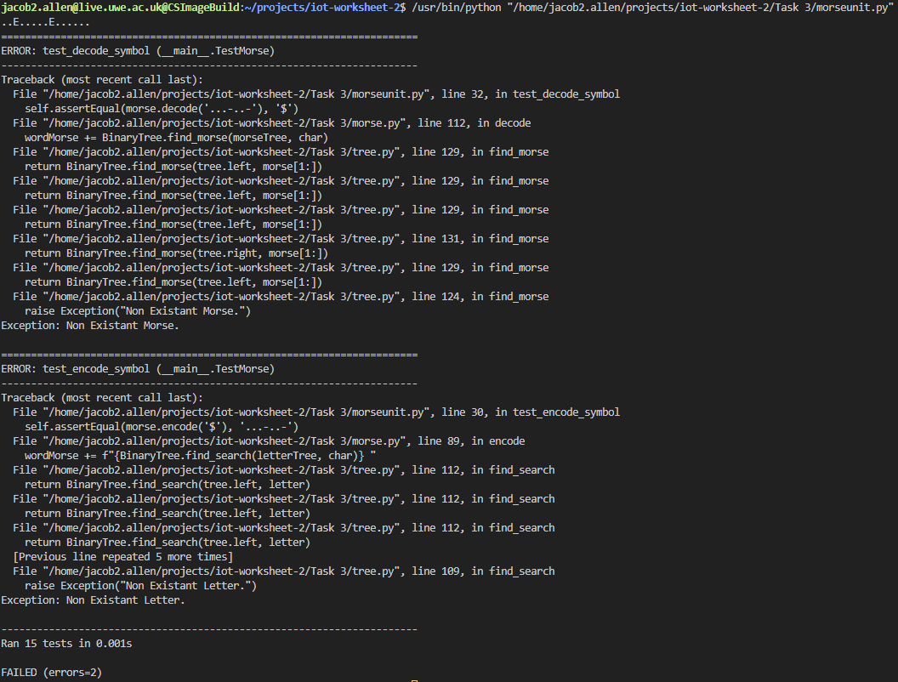
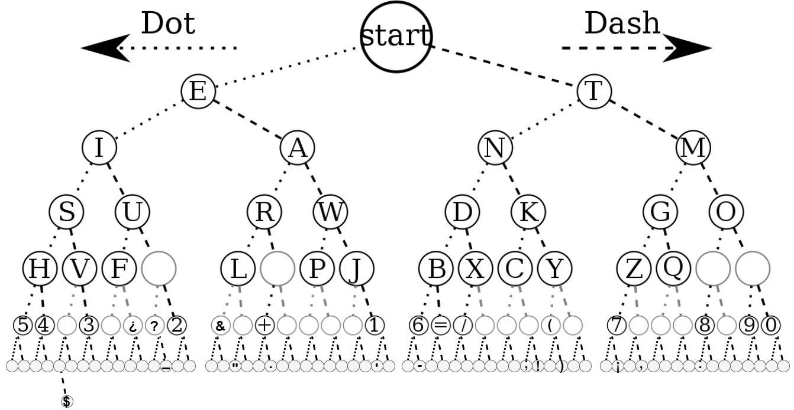
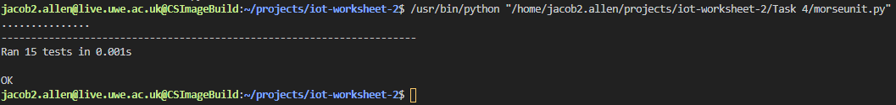
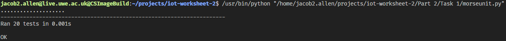
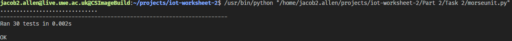
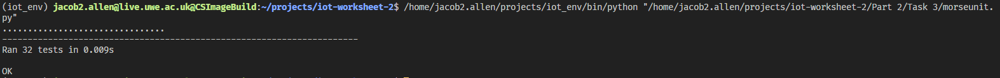

# IOT-Worksheet-2

# **Contents**
1. Part 1
    1. Task 1
    1. Task 2
    1. Task 3
    1. Task 4
1. Part 2
    1. Task 1
    1. Task 2
    1. Task 3

# **Part 1**

## Task 1 Explanation
For this task I was required to convert the word "us" into morse using the webserver provided.

**The word us translated to morse code is ..- ...**

Here is a screenshot of the website running from the server via my machine.


## Task 2 Explanation
Task 2 required me to use a binary tree (similar to the image below) to implement a morse code encoder/decoder.


**To run task 2, run the "Part 1/Task 2/main.py" file. Ensure both "tree.py" and "morse.py" are in the same directory as "main.py".**

Here is a screenshot of me running the file:


To test a different word alter any occurences of the word "us" and its morse code in "Task 2/main.py" file. An example cahange is below.
```py
e = morse.encode('them') 
#WAS PREVIOUSLY e = morse.encode('us')

assert morse.encode('them') == '- .... . --', "Should be - .... . --" 
#WAS PREVIOUSLY assert morse.encode('us') == '..- ...', "Should be ..- ..."

assert morse.decode('- .... . --') == 'them', "Should be them" 
#WAS PREVIOUSLY assert morse.decode('..- ...') == 'us', "Should be us"
```

## Task 3 Explanation
Task 3 required me to unit test the encode, decode and tree implementations. 

The tests I ran are as follows:
- Testing the encode & decode functions.
    1. Encoding the word "us"
    1. Decoding the word "us"
    1. Encoding the word "them"
    1. Decoding the word "them"
    1. Encoding the sentence "this is a test"
    1. Decoding the sentence "this is a test"
    1. Encoding the number "1"
    1. Decoding the number "1"
    1. Encoding the symbol "$" (Expected to fail)
    1. Decoding the symbol "$" (Expected to fail)
- Testing the tree.
    1. Checking an empty tree is correctly created.
    1. Checking a non empty tree is correctly created.
    1. Checking the insert function.
    1. Checking the find functions.

**To run the unit tests, run the "Part 1/Task 3/morseunit.py" file. Ensure both "tree.py" and "morse.py" are in the same directory.**

Here is a screenshot of me running the file:



As you can see all but two tests pass. These 2 tests were expected to fail as I have not implemented symbols into my tree yet. This will be implemented in the next task.

## Task 4 Explanation

Task 4 required me to implement symbols into my binary tree. To do this I first created a new diagram to help me visualise how the new tree would look:



Using the diagram I identified that I would need to add elemtns for the empty nodes in the tree in order for symbols and some numbers to work.

I then updated my unit tests to test each symbol by creating the following tests:
```py
#TESTING THE SYMBOLS
def test_encode_symbols(self):
    self.assertEqual(morse.encode('.'), '.-.-.-')
    self.assertEqual(morse.encode('('), '-.--.')
    self.assertEqual(morse.encode('+'), '.-.-.')
    self.assertEqual(morse.encode('¿'), '..-.-')
    self.assertEqual(morse.encode(','), '--..--')
    self.assertEqual(morse.encode(')'), '-.--.-')
    self.assertEqual(morse.encode('-'), '-....-')
    self.assertEqual(morse.encode('¡'), '--...-')
    self.assertEqual(morse.encode('?'), '..--.')
    self.assertEqual(morse.encode('&'), '.-...')
    self.assertEqual(morse.encode('_'), '..--.-')
    self.assertEqual(morse.encode('\''), '.----.')
    self.assertEqual(morse.encode(':'), '---...')
    self.assertEqual(morse.encode('"'), '.-..-.')
    self.assertEqual(morse.encode('!'), '-.-.--')
    self.assertEqual(morse.encode(';'), '-.-.-.')
    self.assertEqual(morse.encode('$'), '...-..-')

def test_decode_symbols(self):
    self.assertEqual(morse.decode('.-.-.-'), '.')
    self.assertEqual(morse.decode('-.--.'), '(')
    self.assertEqual(morse.decode('.-.-.'), '+')
    self.assertEqual(morse.decode('..-.-'), '¿')
    self.assertEqual(morse.decode('--..--'), ',')
    self.assertEqual(morse.decode('-.--.-'), ')')
    self.assertEqual(morse.decode('-....-'), '-')
    self.assertEqual(morse.decode('--...-'), '¡')
    self.assertEqual(morse.decode('..--.'), '?')
    self.assertEqual(morse.decode('.-...'), '&')
    self.assertEqual(morse.decode('..--.-'), '_')
    self.assertEqual(morse.decode('.----.'), '\'')
    self.assertEqual(morse.decode('---...'), ':')
    self.assertEqual(morse.decode('.-..-.'), '"')
    self.assertEqual(morse.decode('-.-.--'), '!')
    self.assertEqual(morse.decode('-.-.-.'), ';')
    self.assertEqual(morse.decode('...-..-'), '$')
```
**To run the unit tests, run the "Part 1/Task 4/morseunit.py" file. Ensure both "tree.py" and "morse.py" are in the same directory.**

All these tests successfullly pass meaning the implentation of symbols is correct.


# **Part 2**
## Task 1 Explanation
Task 1 required me to implement a binary heap to be used for decoding the morse messages. Todo this, I implemented the following long string of characters to represent the letters. **NOTE: | represents the start of the nodes and * represents a blank node.**
```py
letters_bh = "|ETIANMSURWDKGOHVF*L*PJBXCYZQ**54*3*¿?2&*+****16=/***(*7***8*90*************_****\"**.********'**-********;!*)***¡*,****:****************$**********************************************************************************************************************"
```
The reason blanks have to be included is because without them finding the correct index would be impossible as everything would be out of place an unbalanced.

After implementing this I then added some more unit tests for decoding to test my implementation. These were the same test we previously used to test decode but now they call decode_bt instead.

**To run the unit tests, run the "Part 2/Task 1/morseunit.py" file. Ensure both "tree.py" and "morse.py" are in the same directory.**

All these tests successfully pass meaning the implementation should be correct.


### **Why use a binary heap over the tree?**
A binary heap by definition is essentailly a complete binary tree this means that it is balanced. However a heap is unordered. A heap will have a guaranteed insert/removal time of O(log(n)) wheras for a binary tree it may take a longer amount of time up to O(n).

Binary heaps are also built in linear time O(n) whereas a Bianry Tree requires O(n * log(n)) to be created.

This means overall a heap is a faster data structure than a tree and will be more efficient at handling larger ammounts of data meaning it scales well.

### **Dictionary Implementation**
Another way of implementating a morse code translation system in python would be to use dictionarys. We could simply create a dictionary as such:
```py
MORSE_CODE_DICT = { 'A':'.-', 'B':'-...', 
                    'C':'-.-.', 'D':'-..', 'E':'.', 
                    'F':'..-.', 'G':'--.', 'H':'....', 
                    'I':'..', 'J':'.---', 'K':'-.-', 
                    'L':'.-..', 'M':'--', 'N':'-.', 
                    'O':'---', 'P':'.--.', 'Q':'--.-', 
                    'R':'.-.', 'S':'...', 'T':'-', 
                    'U':'..-', 'V':'...-', 'W':'.--', 
                    'X':'-..-', 'Y':'-.--', 'Z':'--..', 
                    '1':'.----', '2':'..---', '3':'...--', 
                    '4':'....-', '5':'.....', '6':'-....', 
                    '7':'--...', '8':'---..', '9':'----.', 
                    '0':'-----', ', ':'--..--', '.':'.-.-.-', 
                    '?':'..--..', '/':'-..-.', '-':'-....-', 
                    '(':'-.--.', ')':'-.--.-'} 
```
We could then create encode and decode functions that simply find the correct translation by searching the dictionary for the correct key or value. 

# **Task 2 Explanation**
Task 2 required me to implement a system that encodes/decodes via the ham radio conversation standard.
Todo this I implemented two functions, encode_ham and decode_ham
```python
#FUNCTION:      encode_ham(sender, reciever, msg)
#PARAMS:        sender - String, reciever - String, msg - String
#DESCRIPTION:   Will encode a msg to morse code from readable english using the ham radio conversation standard.
#RETURNS:       encode(f"{reciever}de{sender}={msg}=(") - the encoded message.
def encode_ham(sender, reciever, msg):
    return encode(f"{reciever}de{sender}={msg}=(")

#FUNCTION:      encode_ham(sender, reciever, msg)
#PARAMS:        msg - String
#DESCRIPTION:   Will decode morse code to readable english using the ham radio conversation standard.
#RETURNS:       (sender, reciever, msg) - a tuple contianing the sender, reciever and decoded message.
def decode_ham(msg):
    decoded_morse = decode_bt(msg)
    sender = decoded_morse.split("=")[0].split("de")[1]
    reciever = decoded_morse.split("=")[0].split("de")[0]
    msg = decoded_morse.split("=")[1]
    return (sender, reciever, msg)
```
The encode function will convert a msg into an extendend notation morse string following the ham standard: 
**receiver de sender msg**

The decode function will take an encoded message and return a tuple containg the sender, reciever and message.

I also added some more unit tests to test my implementation of the ham standard, these were: 

```python
#TESTING encode_ham AND decode_ham
    #ALL OF THESE SHOULD PASS
    def test_encode_ham_us(self):
        self.assertEqual(morse.encode_ham('s1', 'r1', 'us'), '.-. .---- -.. . ... .---- -...- ..- ... -...- -.--.')
    def test_decode_ham_us(self):
        self.assertEqual(morse.decode_ham('.-. .---- -.. . ... .---- -...- ..- ... -...- -.--.'), ('s1', 'r1', 'us'))
    
    def test_encode_ham_them(self):
        self.assertEqual(morse.encode_ham('s1', 'r1', 'them'), '.-. .---- -.. . ... .---- -...- - .... . -- -...- -.--.')
    def test_decode_ham_them(self):
        self.assertEqual(morse.decode_ham('.-. .---- -.. . ... .---- -...- - .... . -- -...- -.--.'), ('s1', 'r1', 'them'))

    def test_encode_ham_sentence(self):
        self.assertEqual(morse.encode_ham('s1', 'r1', 'this is a test'), '.-. .---- -.. . ... .---- -...- - .... .. ... / .. ... / .- / - . ... - -...- -.--.')
    def test_decode_ham_sentence(self):
        self.assertEqual(morse.decode_ham('.-. .---- -.. . ... .---- -...- - .... .. ... / .. ... / .- / - . ... - -...- -.--.'), ('s1', 'r1', 'this is a test'))

    def test_encode_ham_number(self):
        self.assertEqual(morse.encode_ham('s1', 'r1', '1'), '.-. .---- -.. . ... .---- -...- .---- -...- -.--.')
    def test_decode_ham_number(self):
        self.assertEqual(morse.decode_ham('.-. .---- -.. . ... .---- -...- .---- -...- -.--.'), ('s1', 'r1', '1'))

    #TESTING THE SYMBOLS
    def test_encode_ham_symbols(self):
        self.assertEqual(morse.encode_ham('s1', 'r1', '.'), '.-. .---- -.. . ... .---- -...- .-.-.- -...- -.--.')
        self.assertEqual(morse.encode_ham('s1', 'r1', '('), '.-. .---- -.. . ... .---- -...- -.--. -...- -.--.')
        self.assertEqual(morse.encode_ham('s1', 'r1', '+'), '.-. .---- -.. . ... .---- -...- .-.-. -...- -.--.')
        self.assertEqual(morse.encode_ham('s1', 'r1', '¿'), '.-. .---- -.. . ... .---- -...- ..-.- -...- -.--.')
        self.assertEqual(morse.encode_ham('s1', 'r1', ','), '.-. .---- -.. . ... .---- -...- --..-- -...- -.--.')
        self.assertEqual(morse.encode_ham('s1', 'r1', ')'), '.-. .---- -.. . ... .---- -...- -.--.- -...- -.--.')
        self.assertEqual(morse.encode_ham('s1', 'r1', '-'), '.-. .---- -.. . ... .---- -...- -....- -...- -.--.')
        self.assertEqual(morse.encode_ham('s1', 'r1', '¡'), '.-. .---- -.. . ... .---- -...- --...- -...- -.--.')
        self.assertEqual(morse.encode_ham('s1', 'r1', '?'), '.-. .---- -.. . ... .---- -...- ..--. -...- -.--.')
        self.assertEqual(morse.encode_ham('s1', 'r1', '&'), '.-. .---- -.. . ... .---- -...- .-... -...- -.--.')
        self.assertEqual(morse.encode_ham('s1', 'r1', '_'), '.-. .---- -.. . ... .---- -...- ..--.- -...- -.--.')
        self.assertEqual(morse.encode_ham('s1', 'r1', '\''), '.-. .---- -.. . ... .---- -...- .----. -...- -.--.')
        self.assertEqual(morse.encode_ham('s1', 'r1', ':'), '.-. .---- -.. . ... .---- -...- ---... -...- -.--.')
        self.assertEqual(morse.encode_ham('s1', 'r1', '"'), '.-. .---- -.. . ... .---- -...- .-..-. -...- -.--.')
        self.assertEqual(morse.encode_ham('s1', 'r1', '!'), '.-. .---- -.. . ... .---- -...- -.-.-- -...- -.--.')
        self.assertEqual(morse.encode_ham('s1', 'r1', ';'), '.-. .---- -.. . ... .---- -...- -.-.-. -...- -.--.')
        self.assertEqual(morse.encode_ham('s1', 'r1', '$'), '.-. .---- -.. . ... .---- -...- ...-..- -...- -.--.')

    def test_decode_ham_symbols(self):
        self.assertEqual(morse.decode_ham('.-. .---- -.. . ... .---- -...- .-.-.- -...- -.--.'), ('s1', 'r1', '.'))
        self.assertEqual(morse.decode_ham('.-. .---- -.. . ... .---- -...- -.--. -...- -.--.'), ('s1', 'r1', '('))
        self.assertEqual(morse.decode_ham('.-. .---- -.. . ... .---- -...- .-.-. -...- -.--.'), ('s1', 'r1', '+'))
        self.assertEqual(morse.decode_ham('.-. .---- -.. . ... .---- -...- ..-.- -...- -.--.'), ('s1', 'r1', '¿'))
        self.assertEqual(morse.decode_ham('.-. .---- -.. . ... .---- -...- --..-- -...- -.--.'), ('s1', 'r1', ','))
        self.assertEqual(morse.decode_ham('.-. .---- -.. . ... .---- -...- -.--.- -...- -.--.'), ('s1', 'r1', ')'))
        self.assertEqual(morse.decode_ham('.-. .---- -.. . ... .---- -...- -....- -...- -.--.'), ('s1', 'r1', '-'))
        self.assertEqual(morse.decode_ham('.-. .---- -.. . ... .---- -...- --...- -...- -.--.'), ('s1', 'r1', '¡'))
        self.assertEqual(morse.decode_ham('.-. .---- -.. . ... .---- -...- ..--. -...- -.--.'), ('s1', 'r1', '?'))
        self.assertEqual(morse.decode_ham('.-. .---- -.. . ... .---- -...- .-... -...- -.--.'), ('s1', 'r1', '&'))
        self.assertEqual(morse.decode_ham('.-. .---- -.. . ... .---- -...- ..--.- -...- -.--.'), ('s1', 'r1', '_'))
        self.assertEqual(morse.decode_ham('.-. .---- -.. . ... .---- -...- .----. -...- -.--.'), ('s1', 'r1', '\''))
        self.assertEqual(morse.decode_ham('.-. .---- -.. . ... .---- -...- ---... -...- -.--.'), ('s1', 'r1', ':'))
        self.assertEqual(morse.decode_ham('.-. .---- -.. . ... .---- -...- .-..-. -...- -.--.'), ('s1', 'r1', '"'))
        self.assertEqual(morse.decode_ham('.-. .---- -.. . ... .---- -...- -.-.-- -...- -.--.'), ('s1', 'r1', '!'))
        self.assertEqual(morse.decode_ham('.-. .---- -.. . ... .---- -...- -.-.-. -...- -.--.'), ('s1', 'r1', ';'))
        self.assertEqual(morse.decode_ham('.-. .---- -.. . ... .---- -...- ...-..- -...- -.--.'), ('s1', 'r1', '$'))
```

**To run the unit tests, run the "Part 2/Task 2/morseunit.py" file. Ensure both "tree.py" and "morse.py" are in the same directory.**



As you can see all tasks pass.

# **Task 3 Explanation**
Task 3 required me to connect to the local server using a websocket and implement two functions, send_echo and send_time.

send echo would echo back the message in ham format, and send time would return the current time also in ham format.

I decode the ham format for the responses from both these functions before returning them.

To test this implementation I added 2 more test cases to my morseunit file, these were:
```python
#TESTING THE WEBSOCKET INTEGRATION
    def test_send_echo(self):
        self.assertEqual(asyncio.run(morse.send_echo("s", "test")), ('echo', 's', 'test'))

    def test_send_time(self):
        startTimeGMT = time.strftime("%H:%M:%S", time.gmtime())
        self.assertEqual(asyncio.run(morse.send_time("s")), ('time', 's', startTimeGMT))
        
```

**To run the unit tests, run the "Part 2/Task 3/morseunit.py" file. Ensure both "tree.py" and "morse.py" are in the same directory.**


**NOTE: the time sent back by the server is in the GMT timezone and therefore we need to test for the GMT timezone instead of UTC.** 