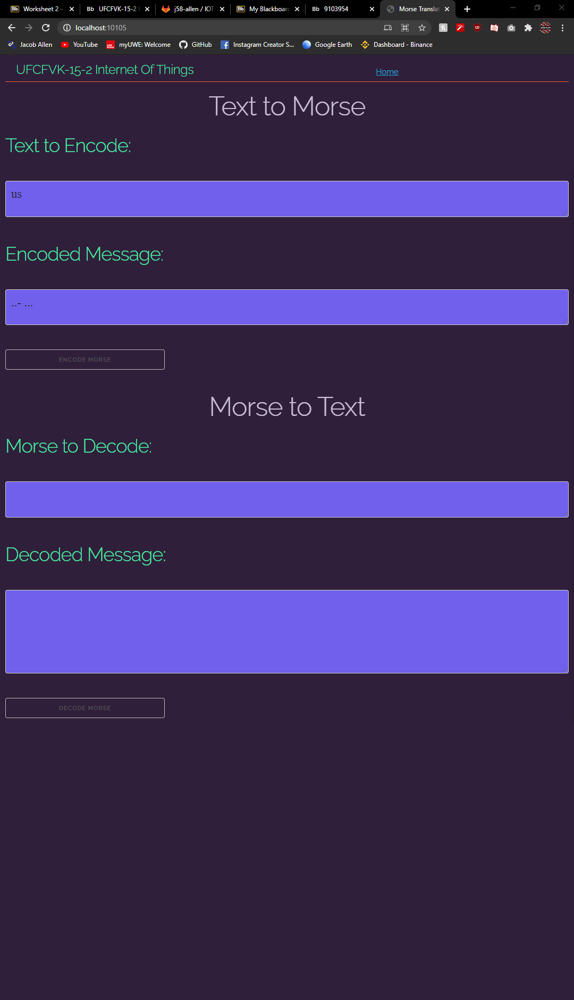

# IOT-Worksheet-2

## Task 1
For this task I was required to convert the word "us" into morse using the webserver provided.

**The word us translated to morse code is ..- ...**

Here is a screenshot of the website running from the server via my machine.

