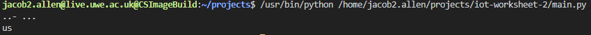

# IOT-Worksheet-2

## Contents
1. [Task 1](#Task-1)
1. [Task 2](#Task-2)
1. [Task 3](#Task-3)

## Task 1
For this task I was required to convert the word "us" into morse using the webserver provided.

**The word us translated to morse code is ..- ...**

Here is a screenshot of the website running from the server via my machine.


## Task 2
Task 2 required me to use a binary tree (similar to the image below) to implement a morse code encoder/decoder.


**To run task 2, run the "Task 2/main.py" file. Ensure both "tree.py" and "morse.py" are in the same directory as "main.py".**

Here is a screenshot of me running the file:



To test a different word alter any occurences of the word "us" and its morse code in "Task 2/main.py" file. An example cahange is below.
```py
e = morse.encode('them') 
#WAS PREVIOUSLY e = morse.encode('us')

assert morse.encode('them') == '- .... . --', "Should be - .... . --" 
#WAS PREVIOUSLY assert morse.encode('us') == '..- ...', "Should be ..- ..."

assert morse.decode('- .... . --') == 'them', "Should be them" 
#WAS PREVIOUSLY assert morse.decode('..- ...') == 'us', "Should be us"
```

## Task 3
